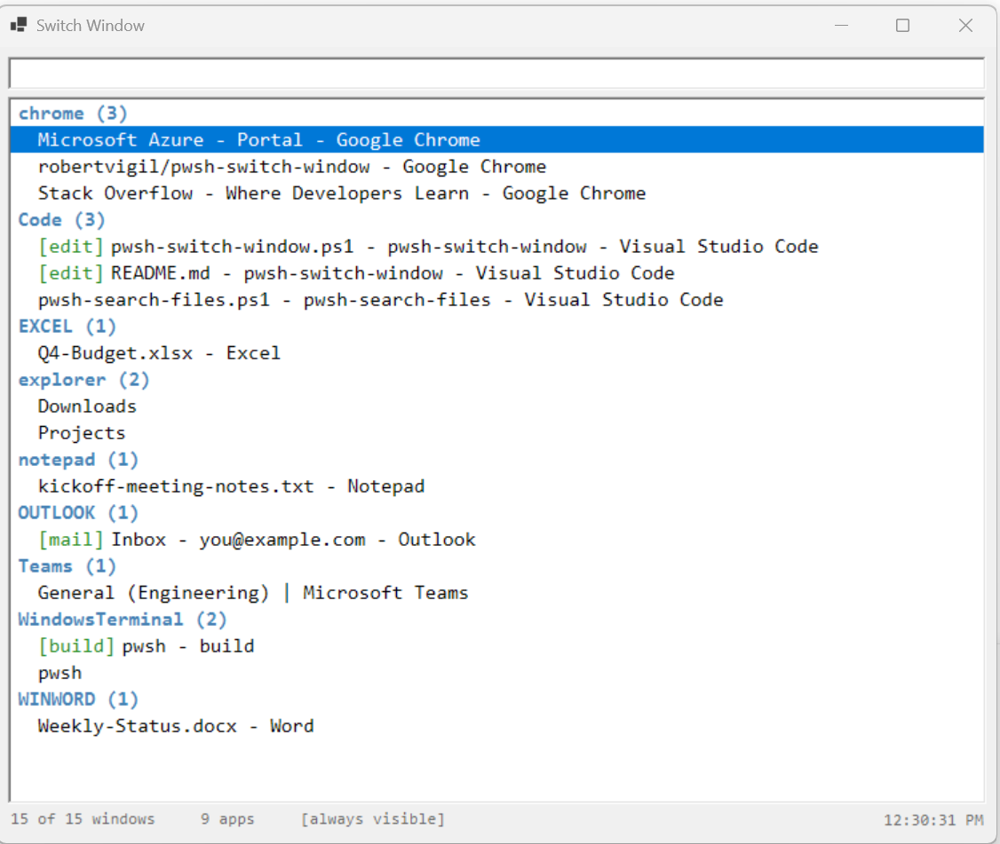

# Switch-Window

A keyboard window switcher for Windows — a searchable list of every open window, summoned from anywhere by a global hotkey. Type to filter, **Enter** to switch.

It's a single paste-in PowerShell 7 script — no install, nothing to build.

**Runs detached:** call `Switch-Window` once and it launches a hidden background process. From then on, **`Ctrl+Alt+W`** pops the switcher up over whatever you're doing; pick a window and it hides again, ready for next time. Your PowerShell prompt stays free the whole time.



## Load it

PowerShell 7 (`pwsh`) only. Copy **`pwsh-switch-window.ps1`** in full, then at the prompt run — once per session:

```powershell
Invoke-Expression (Get-Clipboard -Raw)
```

That defines `Switch-Window`; nothing runs yet.

## Use it

```powershell
Switch-Window
```

That starts the background switcher and prints its PID. Then, from anywhere:

- **`Ctrl+Alt+W`** — summon the switcher
- **Type** — filter on app name + window title
- **Up / Down** — move the selection
- **Enter** / **double-click** — switch to that window (the switcher hides)
- **F5** — refresh the list
- **Esc** — dismiss without switching

Windows are grouped by application under bold headers; a status bar shows the window and app counts and a live clock.

### Commands

Type a command in the search box starting with `!`, then press Enter. The list freezes while you're typing, so the window you'd selected stays the target.

- **`!aot`** — toggle **always-visible** mode. The switcher stops auto-hiding after you pick a window, so it sits open as a panel. While on, the status bar carries an `[always visible]` tag and the list refreshes itself every couple of seconds. The setting is remembered between runs.
- **`!hotkey <combo>`** — change the global hotkey, e.g. `!hotkey Ctrl+Alt+Q`, `!hotkey Win+Space`, `!hotkey Shift+F12`. Modifiers `Ctrl`, `Alt`, `Shift`, `Win`; keys A–Z, 0–9, F1–F12, plus `Space`, `Tab`, `Escape`, `Enter`. The new combo takes effect immediately and is remembered between runs. `!hotkey` alone shows the current binding. Unparseable input or a combo that's already claimed leaves the current hotkey in place and reports the error in a dialog.
- **`!label <text>`** — name the selected window. Labelled windows show a green `[text]` tag and float to the top of their app group. **The label is also matched by the search box** — so labelling all of a project's windows with `my project` lets you filter the list to just that project by typing the label. Labels persist per-user in the Windows registry, so they survive restarts. `!label` alone clears the label.
- **`!quit`** — stop the background switcher (cleaner than hunting down the PID and `Stop-Process`-ing it).
- **`!help`** — open this README (on GitHub) in your browser.

Stop the background switcher when you're done:

```powershell
Stop-Process -Id <pid>     # the PID that Switch-Window printed
```

## Launch via desktop shortcut

If you'd rather skip the paste-load each session, create a Windows shortcut whose target reads `pwsh-switch-window.ps1` and runs the GUI directly. Double-click the shortcut (or pin it to taskbar, or drop a copy in `shell:startup`) and the switcher comes up in a hidden pwsh — no console window, hotkey works the same, `!quit` cleanly closes everything.

Run this snippet once at any pwsh prompt — edit the path to your local copy of the script first:

```powershell
$pwshPath = (Get-Process -Id $PID).Path
$ws       = New-Object -ComObject WScript.Shell
$sc       = $ws.CreateShortcut("$env:USERPROFILE\Desktop\Switch Window.lnk")
$sc.TargetPath  = $pwshPath
$sc.Arguments   = '-STA -NoProfile -WindowStyle Hidden -Command "iex (Get-Content -Raw ''<full path to pwsh-switch-window.ps1>''); & $SwitchWindowGui"'
$sc.WindowStyle = 7   # minimized — keeps the pwsh window hidden
$sc.Save()
```

The `.lnk` is just a recipe: *launch this pwsh.exe, with these args, hidden*. The args tell pwsh to `iex` the script (defining `$SwitchWindowGui` and `Switch-Window`) and then `& $SwitchWindowGui` to run the GUI in that same hidden process. Default icon is pwsh's blue square — right-click the `.lnk` → Properties → Change Icon to customise.

## Roadmap

| version | status |
|---|---|
| v1 | detached background process, global hotkey, persistent — **done** |
| v2 | app-group headers, status bar (count + live clock) — **done** |
| v3 | `!` command mode **(done)**, custom labels **(done)**, `!quit` **(done)**, configurable hotkey **(done)** |

## Notes

- **One instance.** Start `Switch-Window` while one is already running and the second can't claim `Ctrl+Alt+W` — it shows a message box and exits. Stop the running one first.
- **`SetForegroundWindow`.** Windows occasionally flashes a taskbar button instead of raising the chosen window — a long-standing OS limitation.
- **Recovering from a bad hotkey.** If `!hotkey` left you with a combo you can't reach (or another program owns it on next startup), `Stop-Process` the background `pwsh` and delete the value `HKCU:\Software\SwitchWindow:Hotkey` in `regedit` — the next `Switch-Window` falls back to default Ctrl+Alt+W.

---

*Vibe-coded with [Claude Code](https://claude.com/claude-code).*
